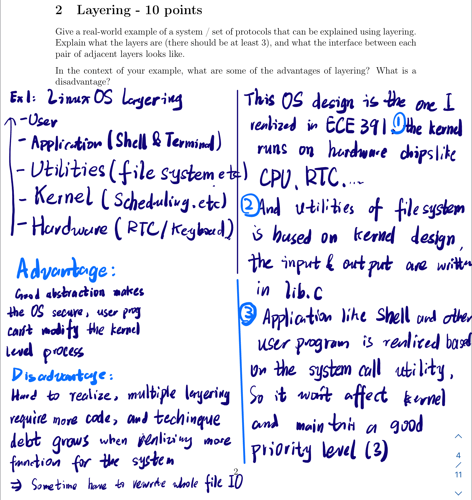
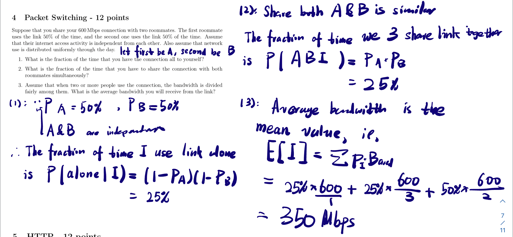
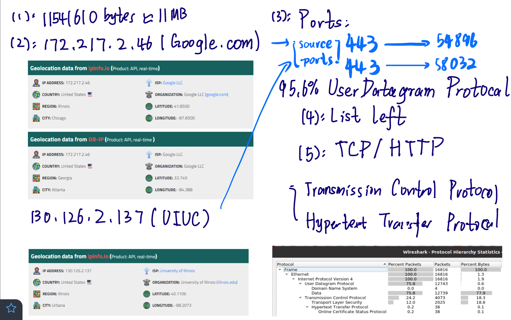

# CS438 Assignment 1

*Jie Wang  jiew5*

*Jiaxin Wu jiaxin19*

## T1  Delay
1. transmission delay from A to S dtrans1=100kB / 80Mbps=10ms
   transmission delay from S to B dtrans2=100kB / 16Mbps=50ms
   $ d_{prop1}=8ms, d_{prop2}=80ms $
    total delay $ d_{total}=10+8+50+80=148ms $
2. $ 148 \div 10=14.8 $. A has sent 14 packages.
3. The n-th packet arrives at S at $(10n+8)ms$, and is transmitted to B at $10+8+50n=(50n+18)ms$ if the buffer is not full.
The second package is transmitted to B at$ 50*2+18=118ms$, and the 11th packet arrives at S at $10*11+8=118ms$
At this moment, the third to the 11th packets are all buffered at S, their size is $9*100kB=900kB$. 
So the buffer will be full after 118ms.
4. When the last packet enters the buffer, there are 8 packets before it and the first packet in the queue has just started transmission. So the queueing delay for the last packet is $ 8*50=400ms$
5. The number of packets is $100MB/100kB=1000.$
The 1000th packet is transmitted to B at $50*1000+18=50018ms$, and arrives at B at $50018+80=50098ms$. So it takes 50.098s for a 100MB file to be sent from A to B.
The average throughput is $100Mb/50.098s=15.969Mbps$
6. For each acknowledgement packet, the total delay is $d_{ack}=100b/16Mbps+80ms+100b/80Mbps+8ms=88.06ms$
Suppose A need to receive the acknowledgement packet for the last packet. The total time it takes to send a 100MB file is $ 148*1000+88.06*1000=236.06s$
The average throughput is $ 100MB \div 236.06s=3.389Mbps $

## T2: Layering

### Ans One

Communication between two country leaders who speak different languages.
There are 3 layers: message layer where the two leaders produce and respond to messages, translation layer where translators translate the messages to a common language, transmission layer where secretaries transmit the messages to another country.
Interface between message layer and translation layer receives a message and outputs it in the required language. Interface between translation layer and transmission layer receives a message and sends it to the translation layer.
Advantages: the whole process is divided into simpler steps.
Disadvantage: there may be delays in each layer.

### Ans Two

## T3: Circuit switch 
1. 7 circuits can be simultaneously supported between A and E. 5 circuits use link A->B->D->E, 1 circuit uses link A->C->B->D->E, 1 circuit uses link A->C->D->E.
2. 8 circuits can be simultaneously supported between B and C. 3 circuits use link B->C, 4 circuits use link B->A->C,1 circuit uses link B->D->C.
3. 9 circuits.

## T4: WIFI RACE CONDITION 

## T5: HTTP 

1. Using Non-Persistent HTTP: 
   - The client establishes a new connection to the server for each image, incurring the $100 ms$ RTT overhead 50 times. 
   - The total transfer time for each image is $10 MB \div 50 MB/s = 0.2s $. Therefore, the total time to load the webpage is $ (0.2s + 2*100ms) * 50 = 20s. $
2. Using Persistent HTTP: 
   - The client establishes a connection to the server and requests all 50 images, one after the other. The total transfer time for all images is $ 50 * 10 MB / 50 MB/s = 10s. $
   - Since the HTTP is persistent, there is no need to cancel the RTT link, incurring 50 + 1 times RTT overhead
   - The total time to load the webpage is $ 100ms + (100ms +0.2)* 50 = 10s + 5s = 15.1s $
3. Using Pipelined Persistent HTTP: 
   - The client establishes a single connection to the server and requests all 50 images at once, allowing the server to start transmitting each image as soon as it is ready. 
   - The HTTP only needs to establish link for one time, so the RTT overhead = 100ms 
   -  The total time to load the webpage images is $ 100ms+100ms+50*0.2s = 10.2s $

## T6 Wireshark practice

## T7 Traceroute

1. First result: None.

 Second result: The 14th hop.
2. First: A single propagation takes at most 4.414/2=2.207ms, so the server is at most $ 2.207*2*105=441.4km $
Second: A single propagation takes at most 206.567/2=103.2835ms, so the server is at most $103.2835*2*105=20656.7km $
3. The time each router takes to return the packets to the sender may be different. If a previous hop takes a long time to return the packet, the RTT of a subsequent hop may be lower than the RTT of a previous one.  
