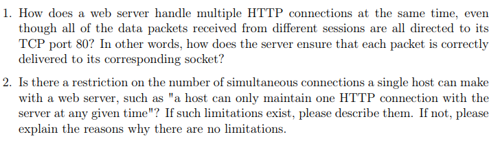

# CS438 Assignment 2
02/17/2023

***Wang, Jie  [jiew5]***
***Wu, Jiaxin [jiaxin19]***

[toc] 

## 1 DNS
The task requires using the **dig** command to provide answers. To ensure accurate results, it is recommended to perform these steps from a computer located on a campus network. The user can refer to the dig documentation to understand how to utilize it.

**Notice: here we use our apartments' WIFI to dig the www.eecs.mit.edu**
**the miteecs.wpengine.com is intermediate web ISP provide by Google**
We tried using rvpn to connect UIUC campus network, but it dons't work for our virtual box.

1. Starting from one of the root servers *a–m.root-servers.net*, perform an iterative lookup for the host www.eecs.mit.edu. For instance, you can initiate the search by using the following command:

dig @h.root-servers.net www.eecs.mit.edu

**Please provide a list of the following information for each name server you visit during the lookup process:**

- (a) Can you specify the **domain name** of the **name server** being visited?
   - **eecs.mit.edu**

​	     -  TLD: edu. 172800 IN NS a.edu-servers.net.TLD: edu. 172800 IN NS a.edu-servers.net.

- (b) Can you provide the IP address of the name server that is currently being used?
   - **35.231.163.5**

- (c) How long did the query take?
   - **Query time: 95 msec**
- (d) What is the round-trip time (RTT) to the server, which can be determined by using the "ping" command to connect to the server?
   - **RTT** = min/avg/max/mdev = 89.990/90.973/99.823/2.098 ms

- (e) For how long can you store the results in cache?

**TTL** = 392     IN      CNAME   miteecs.wpengine.com.
**TTL** = 106     IN      A       35.231.163.5 ( miteecs.wpengine.com. )
**TTL** = 172800  IN      NS      a.gtld-servers.net. (the root server, there are a-m different root server, here I only display one )

2. Perform a recursive query using resolver.illinois.edu of the name www.eecs.mit.edu. 

  - Was this query faster or slower than the sum of the iterative steps? 

  - Why do you think that is?

  **Behavior:** 
  - For the first time, It is much slower than the iterative steps.
    - recursive : 176 ms
    - iterative  : 90 ms

  - At the second time, it is much faster!
    - recursive : 4 ms
    - iterative  : 92 ms

**Possible Reason:**

- At first, we are at the campus circle, whose ISP doesn't directly link to resolver.illinois.edu, the first time the dig need to ask for the request from UIUC resolver

  - At second time, there are already cache to the target server and resolver.illinois.edu, so it performs much faster. 

Second time we run the command: 

*the query time is much faster!*

 a recursive query may be faster than a sum of iterative steps, because the resolver can cache intermediate results and reuse them in subsequent queries. This can reduce the overall query time, especially for frequently accessed domain names.

3. Perform an iterative reverse-mapping query for the address of www.eecs.mit.edu you found in the previous steps, using dig -x. List again the information asked in part 1.

(a) eecs.mit.edu -> CNAME   miteecs.wpengine.com.

(b) SERVER: 66.253.214.16

(c) Query time: 16 msec

(d) RTT = min/avg/max/mdev = 0.013/0.031/0.044/0.007 ms

(e) LTT = 0.031 ms

4. Can you explain why the DNS protocol tends to utilize UDP rather than TCP, considering what has been previously discussed in this inquiry?

The DNS protocol tends to use UDP rather than TCP because the domain queries and responses process are typically small and can be transmitted efficiently with UDP. The content information is provided by the server online, while DNS do not need to establish any long-existing connection. 

In addition, it is important to avoid using UDP for DNS helps to reduce the load on DNS servers and the network as a whole, as UDP messages have a smaller overhead and do not require the same level of reliability as TCP. However, in some cases, DNS queries and responses may be too large for UDP, and in those situations, the protocol can switch to TCP as needed.

### Good Reference:

[(129条消息) DNS基础之使用dig查询DNS解析过程_dig指定dns查询_夜已如歌_ok的博客-CSDN博客](https://blog.csdn.net/zxl1990_ok/article/details/125452535?ops_request_misc=%7B%22request%5Fid%22%3A%22167675861616800217012539%22%2C%22scm%22%3A%2220140713.130102334..%22%7D&request_id=167675861616800217012539&biz_id=0&utm_medium=distribute.pc_search_result.none-task-blog-2~all~baidu_landing_v2~default-2-125452535-null-null.142^v73^insert_down1,201^v4^add_ask,239^v2^insert_chatgpt&utm_term=dig 根服务器&spm=1018.2226.3001.4187)

[(129条消息) Linux下解析域名命令-dig 命令使用详解_linux解析域名的命令_thlzjfefe的博客-CSDN博客](https://blog.csdn.net/thlzjfefe/article/details/124698999?ops_request_misc=%7B%22request%5Fid%22%3A%22167675861616800217012539%22%2C%22scm%22%3A%2220140713.130102334..%22%7D&request_id=167675861616800217012539&biz_id=0&utm_medium=distribute.pc_search_result.none-task-blog-2~all~baidu_landing_v2~default-1-124698999-null-null.142^v73^insert_down1,201^v4^add_ask,239^v2^insert_chatgpt&utm_term=dig 根服务器&spm=1018.2226.3001.4187)

## 2 Client-Server

### Ans:

1. Since $\mu_s /N \le d_{min}$, the $r_c \le d_c$  should be always true for arbitrary c, the data transfer speed is limited by $r_c$

   then we can let $\sum_c r_c = N \times r_c = \mu_s$, i.e. $r_c = \mu_s / N$

   As a result, the minimum distribution time is $T_1 = F/ r_c = F*N / \mu_s $

2. Because $\mu_s /N > d_{min}$, the $r_c \le d_c$  may not be always true for arbitrary c, the data transfer speed is limited by $d_{min}$

Then maximum $ r_c = d_{min}$, it is the rate we need to set for all clients. (Avoid congestion at the client with smallest download bandwith)

>rc: download rate for a client set by the server. $\\$
>dc: max download rate for a client $\\$
>Therefore, the actual download speed for a client would be max{rc, dc}

As a result, the minimum distribution time is $T_2 = F/ r_c  = F/ d_{min} $

3. **We assume the r_c can't change after initial setting**,

      $\mu_s /N = 30/5 = 06 \le d_{min}$,  then we can let $\sum_c r_c = N \times r_c = \mu_s$,

   i.e. $r_c = \mu_s / N = 30/5 = 6$ 
   
   As a result, the minimum distribution time is $T_3 = F/ 6 $

​    

## 3. BitTorrent

1. If Bob does not upload any data, he will not be selected as one of anyone's four best peers. He can download from others only if he is selected as the additional random peer. The opportunity of one peer selecting Bob as the random peer is $\frac{1}{30-4}=\frac{1}{26}$. On average, Bob is the additional peer of $30\times\frac{1}{26}=\frac{15}{13}$ peers. So his average download speed is $80\div5\times\frac{15}{13}=18.46Mbps$.

2. The overall upload rate is $80Mbps\times30=2400Mbps$. The average download rate for the remaining peers is $(2400-18.46)\div30=79.38Mbps$.

3. Each of Bob's client has an opportunity of $\frac{1}{31-4}=\frac{1}{27}$ to be selected by one peer as the additional random peer. On average, each of Bob's client is the additional peer of $30\times\frac{1}{27}=\frac{10}{9}$ peers. So the average download rate for Bob is $2\times80\div5\times\frac{10}{9}=35.56Mbps$.

4. If Bob's two clients start uploading, they can become the top four providers of some other peers, so they can download from more peers than before. On average, the download rate should be 80Mbps for each peer if everyone is uploading. So Bob's downloading performance should see a noticeable improvement.

## 4 . DHT

### Ans:

1. Because id is 8-bit, so the maximum Hashing ID# $= 2^8 = 256 $

   And the Hashing ID space = $\{0,1,2,3,...,255\}$

2. |      | key_value | peer_value |
   | ---- | --------- | ---------- |
   | (a)  | 19        | **26**     |
   | (b)  | 125       | **12**     |

   Because: 

   - rule: assign key-value pair to the peer that has the  closest ID
   - convention: closest peer is the immediate successor of  the key

3. **6 times,** 

   - the key 23 is associated with peer 26, there are 5 nodes between 26 and 88 $\{104,124,12,16,26\}$
   - node **26** needs one return value message, which is counted as one additional message

   therefore, it takes 6 messages in total 

4. **5 times,** 

   - the key 111 is associated with peer 124, there are 4 nodes between peers 12 and 124 $\{26,73,104,124\}$ (using shortcuts)
   - node **124** needs one return value message, which is counted as one additional message

   therefore, it takes 5 messages in total 

5. (a) the maximum time happens when the target peer is just the predecessor of initiation peer, i.e. the search goes through the whole circle table.

   $ \rightarrow$ **8 times** 

   (b) First we clarify, for current peer, its **next two successors are **

   - next node by walking the circle
   - next node by walking the cord

   Then, similar to <u>(a) and 4</u>, the maximum messages number is **5** 

6. According to symmetry rule, each cord of a DHT with minimum inquiry time should have peer nodes with equal intervals. The following figure is the optimal cord arrangement diagram drawn by me:

   

   In which, the maximum messages number in each query search is **4.**

   - Take $16 \rightarrow 12$ as an example, it goes through $\{73,124,12\}$ 3 nodes, and need one extra response message. Since 12 is the predecessor of 16, we can confirm this is the longest routine. 

   All other combinations are draw and test to be inefficient compared to this one. 

   ### Proof of the optimization of my arrangement:
   Assume the minimized maximum number of messages needed is 3. (*)
   
   Then for each search, there is at most one peer between the initial peer and the target peer. So the target peer must be an immediate or secondary successor of the initial peer. 
   
   Since each peer has one successor by walking the circle and another by walking the cord,each peer has two successors, adding up to 4 secondary successors. So each peer can have at most 2+4=6 peers which it can reach within two steps (three messages, which ack response). 
   
   However, there are 8 peers in total, so each peer has at least one peer requiring more than three messages. This implies assumption (*) contradicts to the problem, we can say there do not exist such an arrangement better than mine. 

   Therefore, the arrangement I draw is optimized. 
   Q.E.D.

   
   
   

   
   

## 5. HTTP Connections

### Ans:

1. **Server based on Socket**

**Socket distribution connects HTTP request with corresponding destination ip.** 

When a web server receives HTTP requests from multiple clients, each connection is established on a different socket at the server. Here although different clients used same port 80, they can be redirect back to the according socket and the header info. 

Take our MP1 code for an example, the code is based on Linux system, and everything in Linux is a file. Therefore, the socket is distributed by different socket file descriptor (sockfd). Each time the server check the sockfd to accept new request, and fork the process to send back necessary HTTP header and file (if 200 OK). 

In summary, it is a demultiplexing procedure, where web servers differentiate between different connections using sockets, allowing it to handle multiple HTTP connections simultaneously.

2. The answer is different on different operating system and HTTP architecture. 

**But, the overall restriction is the hardware limit and the socket fd number.**

Take Linux for an example, since the socket file descriptor is a int16_t number, the maximum can only be 2^15 = 32768

However, you can still use some technique like CDN to enlarge this maximum. For instance, we can construct distributed server in different region, and connect user's request with the nearest one. Therefore, we can handle high-concurrency requirement in the application. For instance, the Amazon server during the Black Friday. 

## 6. Reliable Data Transfer

1. The transmission dalay for a packet is $$D_{trans}=\frac{L}{R}=\frac{1200bytes}{40\times10^6bits/sec}=0.24ms$$  
   The transmission delay for the reserved bits of a packet is $$D^\prime_{trans}=\frac{L_{reserved}}{R}=\frac{32bits}{40\times10^6bits/sec}=0.0008ms$$  
   The network utilization is $$U=\frac{D_{trans}-D^\prime_{trans}}{RTT+D_{trans}}=\frac{0.24-0.0008}{25\times2+0.24}=0.004757$$

2. The timeout value should be not be too low to avoid unneccessary resending. It should not be too high as well, or otherwise it takes more time for the sender to detect a loss and resend the packet.
At least, it must be bigger than 50.2408ms.

3. They can use pipelined protocols where Alice can allow multiple, yet-to-be-acknowledged packets in pipeline.

4. The utilization of the network will be increased.
The original sender utilization is $$U_{sender}=\frac{L/R}{RTT+L/R}$$ After using pipelined protocols, if Alice can allow N unacked packets in pipeline, the sender utilization becomes $$U_{sender}=\frac{N*L/R}{RTT+L/R}$$

### Useful Reference:
https://campuswire.com/c/G8B863314/feed/399

[Reliable Data Transfer (umn.edu)](https://www.d.umn.edu/~gshute/net/reliable-data-transfer.xhtml)
