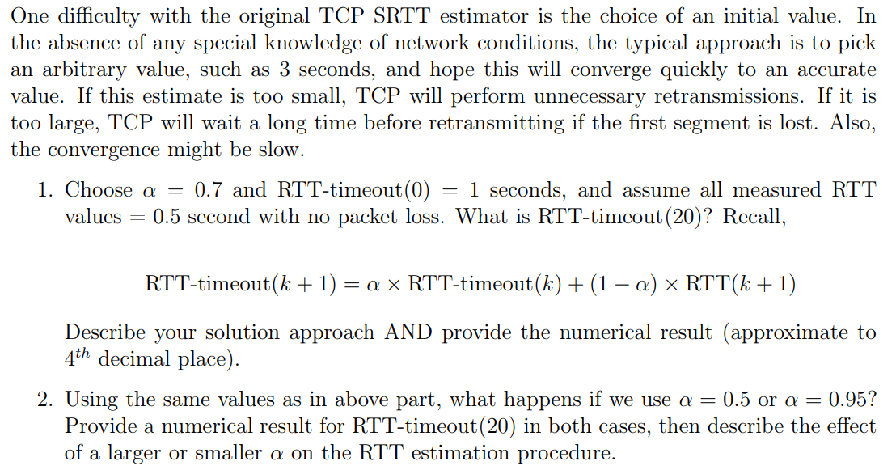
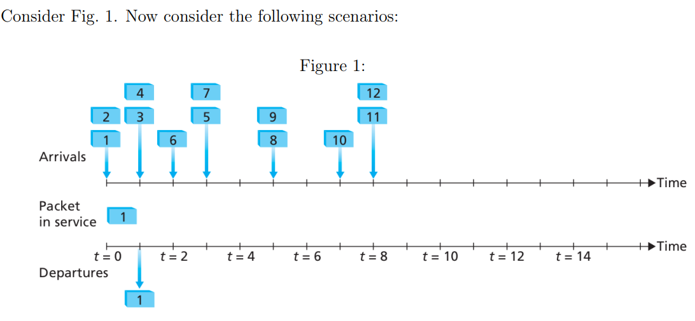
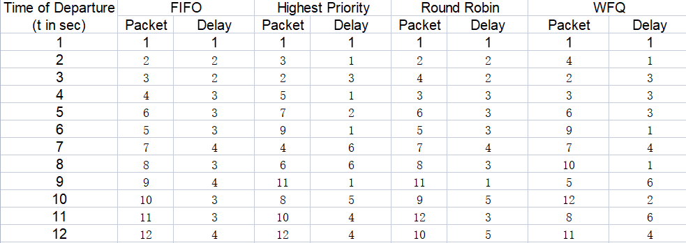
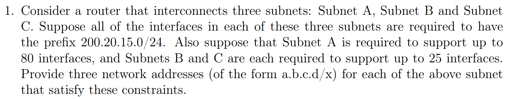
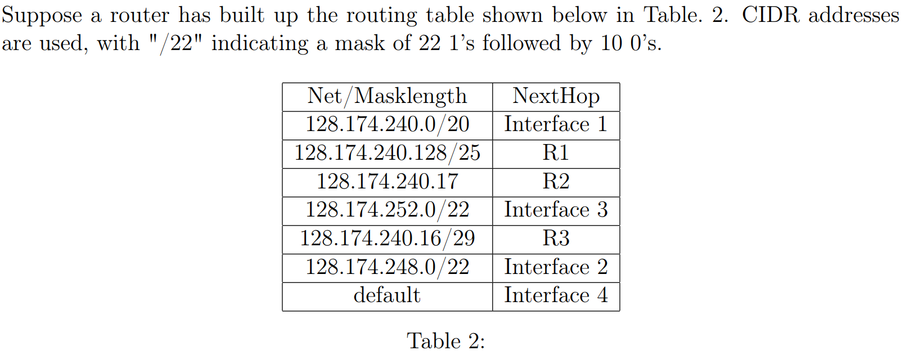
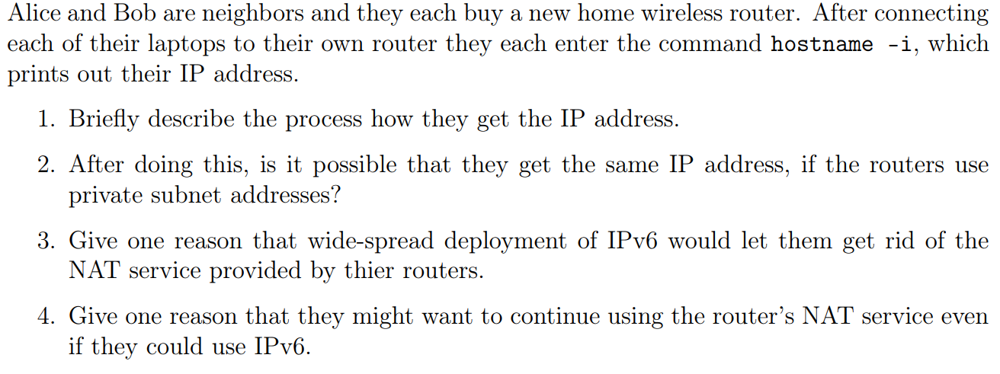
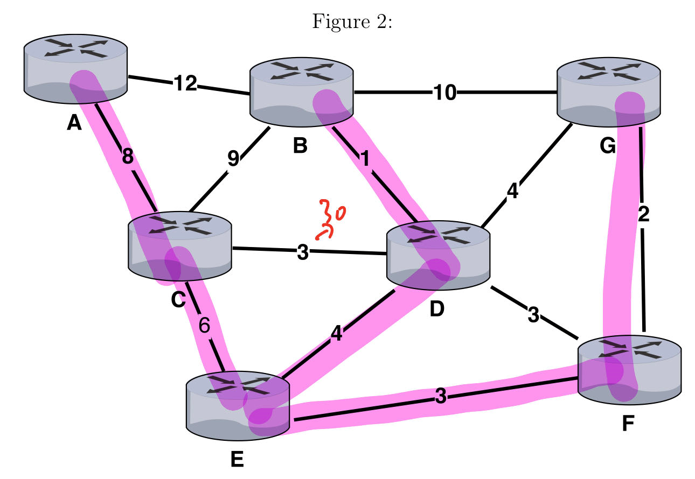
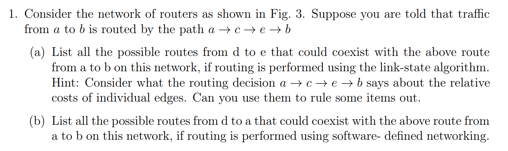
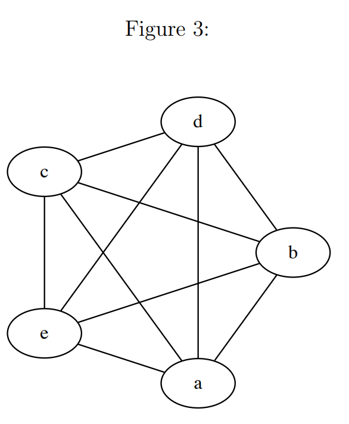
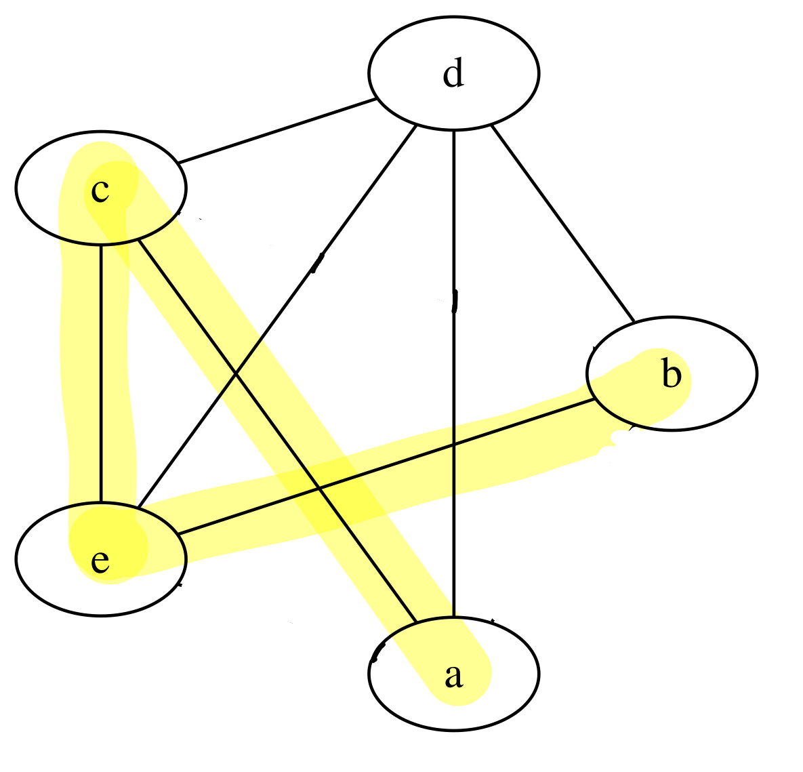

# CS438 Assignment 3
03/31/2023

***Wang, Jie  [jiew5]***
***Wu, Jiaxin [jiaxin19]***

[toc]

## 1. TCP RTT Estimation



### (1) $\alpha = 0.7$

$$
\begin{align}
RTT\text{-}timeout(1) &= \alpha × RTT\text{-}timeout(0) + (1 − \alpha) × RTT(1) \\
RTT\text{-}timeout(2) &= \alpha × RTT\text{-}timeout(1) + (1 − \alpha) × RTT(2) \\
&= \alpha × (\alpha × RTT\text{-}timeout(0) + (1 − \alpha) × RTT(1)) + (1 − \alpha) × RTT(2) \\
&= \alpha^2 × RTT(0) + \alpha(1-\alpha)×RTT(1) + (1-\alpha) × RTT(2) \\ 
Since\  RTT(1)&=RTT(2)=0.5 s, RTT\text{-}timeout(2) = \alpha^2 × RTT(0) +(1-\alpha^2) × 0.5,
\end{align}
$$

Similarly substitute **RTT-timeout(k)** with previous result when computing each **RTT-timeout(k+1),** we have  :
$RTT\text{-}timeout(k) = \alpha^k × RTT(0) + (1-\alpha^k) × 0.5$ 

 Therefore, 

$RTT\text{-}timeout(20) = \alpha^{20} × RTT(0) + (1-\alpha^{20}) × 0.5 = 0.7^{20}×1+(1-0.7^{20})×0.5 \approx 0.5004s.$

### (2) $\alpha = 0.5 \& 0.95$, what differs?

Here we use same formula based on (1)

If α = 0.5, $RTT\text{-}timeout(20) = 0.5^{20}×1+(1-0.5^{20})×0.5 \approx 0.5000s.$  
If α = 0.95, $RTT\text{-}timeout(20) = 0.95^{20}×1+(1-0.95^{20})×0.5 \approx 0.6792s.$
If α is larger, each measured RTT has a smaller effect on the estimated RTT value, so the estimated RTT value converges more slowly to an accurate RTT value.

If α is smaller, each measured RTT has a larger effect on the estimated RTT value, so the estimated RTT value converges faster to the accurate RTT value.

> Note: the conclusion here is based on the fact that measured RTT always stay the same

### Python code implementation

```python
import numpy as np
def RTT_compute(k,alpha,RTT_mesaure):
    print("now start alpha == ",alpha)
    RTT_0 = 1
    RTT = RTT_0
    for _ in range(k):
        RTT = alpha*RTT + (1-alpha)*RTT_mesaure
        if np.abs( RTT - RTT_mesaure) < 0.00001:
            print("Premature, loop times is ",_)
            break
    return(RTT)

a1 = RTT_compute(20,0.7,0.5)
print("a1 is ",a1)
a2 = RTT_compute(20,0.5,0.5)
print("a2 is ",a2)
a3 = RTT_compute(20,0.95,0.5)
print("a3 is ",a3)

```

Output:
```
now start alpha ==  0.7
a1 is  0.5003989613314881
now start alpha ==  0.5
Premature, loop times is 15
a2 is  0.5000076293945312
now start alpha ==  0.95
a3 is  0.679242961204271
```

This approach further prove the correctness of our closed-form formula

<div STYLE="page-break-after: always;"></div>

## 2. Fair Queuing



### (1) Table 1: Packet Scheduling



### (2) Performance Analysis

- For FIFO: Average delay is **2.9167**s.  
- For highest priority:
  - Overall average delay is **2.9167**s.  
  - average delay is **1.167s** for high priority class
  - **4.667s** for low priority class.
  
- For Round Robin
  - Overall average delay is **2.9167**s.  
  - average delay is **3.286s** for class 1 
  - average delay is **2.4s**   for class 2.

- For WFQ:
  - Overall average delay is **2.9167**s.  
  - average delay is **2.5s** for class 0, 
  - average delay is **2s** for class 1 
  - average delay is **4.25s** for class 2.


### (3) Observation

- The **overall average delay** for the 4 scheduling policies are similar.
- In Highest priority and WFQ, the average delay of a **class with a higher priority** or a **larger weight** is smaller than other classes.

<div STYLE="page-break-after: always;"></div>

## 3. Forwarding and CIDR



### (1) Classful IP Addressing

The prefix 200.20.15.0/24 means that the first 24 bits are fixed, and we have 8 bits to work with for subnetting.

#### Subnet A

Because A needs 80 interfaces, which is within $(2^6,2^7 )$ , so the router should assign A with 7 bits. 

Therefore, **Subnet A: ** ***200.20.15.0/25*** 

(200.20.15.0 to 200.20.15.127 )

#### Subnet B

Because B needs 25 interfaces, which is within $(2^4,2^5 )$ , so the router should assign B with at least 5 host bits. Note we need to increase from A, the subnet mask should be ***/27*** . 

Therefore, **Subnet B: ** ***200.20.15.128/27*** 

(200.20.15.128 to 200.20.15.159)

#### Subnet C

Because C needs 25 interfaces, which is within $(2^4,2^5 )$ , so the router should assign c with at least 5 host bits. Note we need to increase from b, the subnet mask should still be ***/27*** . 

Therefore, **Subnet B: ** ***200.20.15.160/27*** 

(200.20.15.160 to 200.20.15.191)


### (2) IP-match pair



Based on Table-2, **How many individual IP addresses match each Net/Masklength pair?**

 (Compute this for all entries in the table except the last one, i.e. for the default Masklength entry).

**Ans:**

|   Net/Masklength   |   NextHop   | # of Individual IP addresses | IP range field                                               |
| :----------------: | :---------: | :--------------------------: | ------------------------------------------------------------ |
|  128.174.240.0/20  | Interface 1 |             4096             | 128.174.240.0 to 128.174.255.255                             |
| 128.174.240.128/25 |     R1      |             128              | 128.174.240.128 to 128.174.240.255                           |
|   128.174.240.17   |     R2      |              1               | A single IP address within the range of the first subnet     |
|  128.174.252.0/22  | Interface 3 |             1024             | 128.174.252.0 to 128.174.255.255 (overlaps with the first subnet 128.174.240.0/20) |
| 128.174.240.16/29  |     R3      |              8               | 128.174.240.16 to 128.174.240.23 (falls within the second subnet 128.174.240.128/25) |
|  128.174.248.0/22  | Interface 2 |             1024             | 128.174.248.0 to 128.174.251.255 (overlaps with the first subnet 128.174.240.0/20) |
|      default       | Interface 4 |             NULL             | NULL (All the other ip left)                                 |

### (3) NextHop jumping

The router can deliver packets directly over interfaces 1, 2, 3, 4, or it can forward to routers R1, R2, R3. 

- **Specify the next hop for each of the following destinations**. Use the longest prefix match, i.e., if a destination matches more than one line of the table, the longest match is used.

| IP address             | destination hop        |
| ---------------------- | ---------------------- |
| **(a) 128.174.240.17** | R2                     |
| **(b) 128.174.245.17** | Interface 1            |
| **(c) 128.174.250.17** | Interface 2            |
| **(d) 128.174.254.17** | Interface 4 ( no pair) |
| **(e) 128.174.225.17** | Interface 1            |
| **(f) 128.174.240.18** | R3                     |


<div STYLE="page-break-after: always;"></div>

## 4. DHCP and NAT



### (1) How do they fetch ip 

The whole procedure is based on Dynamic Host Configuration Protocol (DHCP):

- Alice and Bob's laptops (hosts) request IP address separately from their own router. 
  - Hosts broadcasts "*DHCP discover*" msg
- Routers use their integrated DHCP server to respond the latptops,
  - DHCP server respond with "*DHCP offer*" msg

- Laptops know there is a router, then request for an IP
  - Host request IP with "*DHCP request*" msg

- And these routers obtain the IP address from network server when joining the network (If it is the first time connecting network).
- DHCP server send laptops with available IP address: 
  - DHCP server respond with "*DHCP ack*" msg

After router connecting to the internet, it creates a close subnet and connect with the new laptop via private subnet addresses. 

### (2) Same ip?

Yes it is possible they fetch same private subnet IP address. Especially if the router use NAT(network address translation) on them, Alice and Bob may have same local ip address 192.168.56.101. 

However, there won't be any collision because two laptops are in different network, which cannot be routed externally. 

If the hosts need to route outside internet, it would use NAT service to translate their IP and request for information through the router. 

 

### (3) IPv6 development?

Since IPv6 has 128-bit IP addressability, Alice and Bob may not need NAT service. Because the IPv6 is large enough to allocate globally distinct address with any devices connecting to the internet. 

This would simplify end-to-end communication and potentially improve the performance of certain applications, such as P2P file sharing. 

### (4) Why still NAT?

- To begin with, the IPv4 is still widely used around the world, most of the web service are still based on it. Connecting IPv6 is not enough for them to surf the internet. 
- Secondly, NAT provides a basic level of security. By translating private IP addresses to a single public IP address, NAT hides the internal network structure and makes it more difficult for external devices to directly access devices within the home network
- Additionally, NAT can help conserve global IP addresses by allowing multiple devices to share a single public IP address. Maybe in the future, the huge addressability of IPv6 can still be used up, and NAT will help to solve this problem a lot. 

<div STYLE="page-break-after: always;"></div>

## 5. Distance Vector Routing

### (1) Shortest Path Tree

> **Derive and draw the shortest-path tree from nodes E using the Dijkstra’s algorithm**. 
>
> Show how the cost of path and predecessor node along path converge step-by-step in a table as demonstrated in the lecture slides. 

- Dijkstra's Table (Here the node sequence is based on BFS, it can also be turned into dictionary order).

| Step | Node Visited | Dist(C) | Dist(D) | Dist(F) | Dist(A)   | Dist(B)  | Dist(G)  |
| ---- | ------------ | ------- | ------- | ------- | --------- | -------- | -------- |
| 0    | E            | 6,E     | 4,E     | **3,E** | $\infin$  | $\infin$ | $\infin$ |
| 1    | EF           | 6,E     | **4,E** |         | $\infin$  | $\infin$ | 5,F      |
| 2    | EFD          | 6,E     |         |         | $\infin$  | 5, D     | **5,F**  |
| 3    | EFDG         | 6,E     |         |         | $\infin$  | **5,D**  |          |
| 4    | EFDGB        | **6,E** |         |         | 17, B     |          |          |
| 5    | EFDGBC       |         |         |         | **14, C** |          |          |
| 6    | EFDGBCA      |         |         |         |           |          |          |

Note: **Bold** means the time one node reaches its shortest path from E

The shortest path tree drawn as the Figure 2 below:
 

### (2) Routing table using DV algo

> **Compute routing tables for nodes B, D and E using the distance vector algorithm.** 
>
> The table rows should include a Destination, Distance, and Next Hop. 
>
> (Please show intermediate results for partial credit. )

Node B:

| Destination | Distance | Next Hop |
| ----------- | -------- | -------- |
| A           | 12       | A        |
| C           | 9        | C        |
| D           | 1        | D        |
| G           | 10       | G        |
|             |          |          |

Node D:


Routing table for B:

| Destination | Distance | Next Hop    A |
| ----------- | -------- | ------------- |
|             |          |               |
|             |          |               |
|             |          |               |
|             |          |               |
|             |          |               |


### (3)Edge increase case

1. Now consider a situation in which link between the D-C becomes congested and its costs become 30. List a sequence of updates to routing tables at nodes B and D, in order, until the routing tables converge


<div STYLE="page-break-after: always;"></div>

## 6. Routing Algorithms

### (1) Known one path 





#### (a) Possible moves from d ->e

>  List all the possible routes from d to e that could coexist with the above route from a to b on this network, if routing is performed using the link-state algorithm. Hint: Consider what the routing decision a → c → e → b says about the relative costs of individual edges. Can you use them to rule some items out.

Based on the knowledge of shortest path (a-c-e-b), we can build a new graph 

$G' = G - (a \leftrightarrow b)-(c \leftrightarrow b)- (a \leftrightarrow e)$,

 because $a \leftrightarrow b $, $(a \leftrightarrow e)$ and $c \leftrightarrow b $ is too long. We have G' below:



Then, the possible path from d to e is :
- d->e  
- d->c->e  
- d->b->e  
- d->a->c->e  

#### (b) SDN-based routing from d to a

>  List all the possible routes from d to a that could coexist with the above route from a to b on this network, if routing is performed using software- defined networking.

In a software-defined networking (SDN) scenario, the routing decisions are made by a centralized controller, which has complete knowledge of the network topology and can dynamically adapt to network changes.

As a result, the SDN controller can make use of any available path between two nodes, even if it's not the shortest path. Therefore, we don't need to build a new graph G' in this case and can use any available path without a loop from d to a.

1.d->a
2.d->b->a
3.d->b->c->a
4.d->b->e->a
5.d->b->c->e->a
6.d->b->e->c->a
7.d->c->a
8.d->c->b->a
9.d->c->e->a
10.d->c->b->e->a
11.d->c->e->b->a
12.d->e->a
13.d->e->b->a
14.d->e->c->a
15.d->e->b->c->a
16.d->e->c->b->a

### (2) Routing Protocol Evaluation
> Sort the following protocols by the amount of state each node maintains, and give clear explanation.
> • Link State
> • Distance Vector
> • Path Vector

Answer: **Distance Vector < Link State < Path vector**
Explanation:
• Distance Vector algorithm:
Each node estimates its cost to the destination, and maintains cost to each of its neighbors and the distance vector of each of its neighbors.
• Link State algorithm:
Each node maintains the least cost paths from itself to all other nodes, as well as the next hop in the least cost path, so each node maintains more state information than Distance Vector algorithm.
• Path Vector algorithm:
Each node maintains a path vector for each destination which contains the entire path information to the destination node, so each node maintains more state information than Link State algorithm.