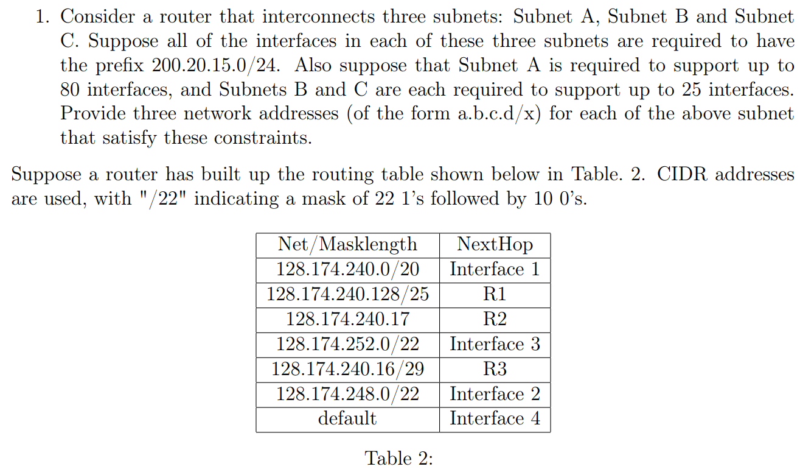
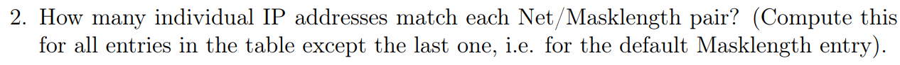
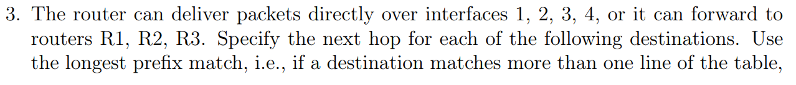

# CS438 Assignment 3
03/31/2023

***Wang, Jie  [jiew5]***
***Wu, Jiaxin [jiaxin19]***

[toc]


## 1. TCP RTT Estimation


### (1) $\alpha = 0.7$

Refer to 

### (2) $\alpha = 0.5 \& 0.95$, what differs?


### Python code implementation

```python
```


## 2. Fair Queuing


### (1) Table 1: Packet Scheduling

| Time       | FIFO |       | Highest | Priority | Round | Robin | WFQ  |       |
| ---------- | ---- | ----- | ------- | -------- | ----- | ----- | ---- | ----- |
| (t in sec) | PKT  | DELAY | PKT     | DELAY    | PKT   | DELAY | PKT  | DELAY |
| **1**      | 1    | 1     | 1       | 1        | 1     | 1     | 1    | 1     |
| 2          |      |       |         |          |       |       |      |       |
| 3          |      |       |         |          |       |       |      |       |
| 4          |      |       |         |          |       |       |      |       |
| 5          |      |       |         |          |       |       |      |       |
| 6          |      |       |         |          |       |       |      |       |
| 7          |      |       |         |          |       |       |      |       |
| 8          |      |       |         |          |       |       |      |       |
| 9          |      |       |         |          |       |       |      |       |
| 10         |      |       |         |          |       |       |      |       |
| 11         |      |       |         |          |       |       |      |       |
| **12**     |      |       |         |          |       |       |      |       |

## 3. Forwarding and CIDR



### (1) Classful IP Addressing

- **Subnet A: ** 200.20.15.




### (2) IP-match pair

How many individual IP addresses match each Net/Masklength pair? (Compute this for all entries in the table except the last one, i.e. for the default Masklength entry).




### (3)

The router can deliver packets directly over interfaces 1, 2, 3, 4, or it can forward to routers R1, R2, R3. Specify the next hop for each of the following destinations. Use the longest prefix match, i.e., if a destination matches more than one line of the table, the longest match is used.

(a) 128.174.240.17 

(b) 128.174.245.17

(c) 128.174.250.17

(d) 128.174.254.17 

(e) 128.174.225.17 

(f) 128.174.240.18


## 4. DHCP and NAT


### (1) How do they fetch ip 


### (2) Same ip?


### (3) IPv6 development?


### (4) Why still NAT?


## 

