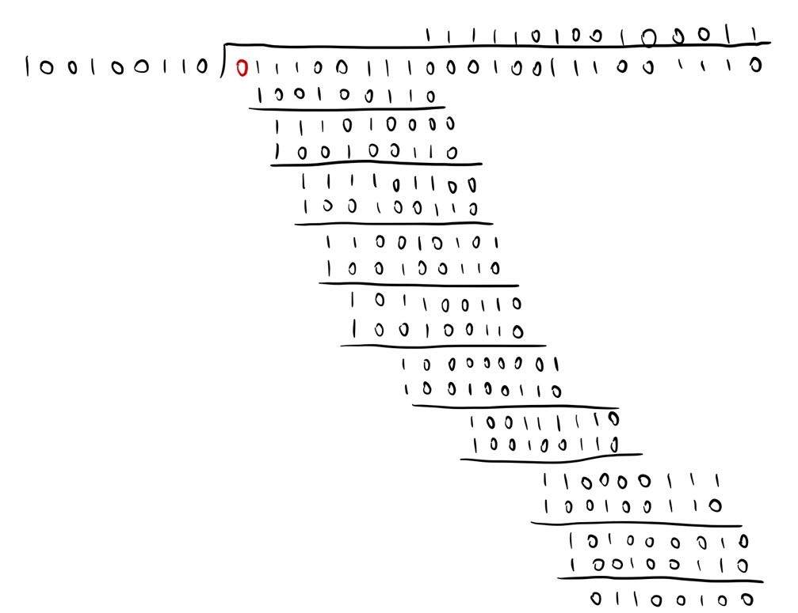

# CS438 Assignment 4

04/27/2023

***Wang, Jie  [jiew5]***
***Wu, Jiaxin [jiaxin19]***

## 1. BGP Policy

### 1. ASes to X:

- A: A, D, C, Z, X
- B: B, A, D, C, Z, X
- C: C, Z ,X 
- D: D, C, Z, X
- V: V, W, Z, X
- W: W, Z, X
- X: X
- Y: Y, Z, X
- Z: Z, X

### 2. Y hate W

Yes, it is possible.

Y can still reach all ASes by the following paths:

A: Y, Z, C, D, A
B: Y, Z, C, D, A, B
C: Y, Z, C
D: Y, Z, C, D
V: Y, Z, C, D, A, V
X: Y, Z, X
Y: Y
Z: Y, Z

### 3.  W hate X

Yes, it is possible.

X can still reach all ASes by the following paths:
A: X, Z, C, D, A
B: X, Z, C, D, A, B
C: X, Z, C
D: X, Z, C, D
V: X, Z, C, D, A, V
X: X
Y: X, Z, Y
Z: X, Z

## 2. SDNs

Referring to  [Openflow docs](https://opennetworking.org/wp-content/uploads/2013/04/openflow-spec-v1.0.0.pdf): we need to specify:

- **nw_proto**: where 6 denotes TCP, 17 denotes UDP
- **nw_src**
- **nw_dst** 

In the matching rule

### 1. h2&h5 to h3&h4
- Matching rule: if (source ip = 10.1.0.2 or 10.3.0.5) and destination ip = 10.2.0.3

  - Action: forward to h3
  - Else: drop

- Matching rule: if (source ip = 10.1.0.2 or 10.3.0.5) and destination ip = 10.2.0.4
  - Action: forward to h4
  - Else: drop

### 2. Only TCP to h3&h4
- Matching rule:  IP protocol attribute is TCP and destination ip = 10.2.0.3
  - if ( nw_proto == 6 && nw_dst == 10.2.0.3)
  - Action: forward(h3)
  
- Matching rule:  IP protocol attribute is TCP and destination ip = 10.2.0.4
  - if ( nw_proto == 6 && nw_dst == 10.2.0.4)
  - Action: forward(h4)

### 3. Block h3 only
- Matching rule: if destination ip = 10.2.0.4
  - Action: forward(h4)

### 4. h6-UDP-h3 only
- Matching rule: 
  - source ip = 10.3.0.6 , destination ip = 10.2.0.3 and  P protocol attribute is UDP
  - if ( nw_proto == 17 && nw_src  == 10.3.0.6 && nw_dst == 10.2.0.3)
  - Action: forward(h3)

> Citation:
>
> [Campuswire:  TCP or UDP would be specified by the IP prot, or nw_proto](https://campuswire.com/c/G8B863314/feed/1076)

## 3. Synthesis

## 4. Error Detection

### 1. Parity Check 

#### (a) 1

#### (b) 4+4 +1 = 9

#### (c) & (d)array:

#### 

#### (e)

- **Advantage:** 2D parity can self-detect and correct single-bit errors. It is more powerful

- **Disadvantage:** 2D parity requires more parity bits, increasing the overhead and space complexity

### 2. Cyclic Redundancy Checksum

#### (a) Shown below:

#### (b) 1111 0011 1000 1001 1100 1110
"1111 0011 1000 1001" + 8 CRC bit
#### (c) The receiver divides the received bit stream <D,R> by G using modulo 2 long division. If the remainder is not zero, error is detected.

#### (d) Shown below

### 3. Checksum

0x7EFF = 0111 1110 1111 1111
0xAAC8 = 1010 1010 1100 1000
0xEC05 = 1110 1100 0000 0101
0x7EFF + 0xAAC8 = 1 0010 1001 1100 0111
**Wrap around:** 

0x7EFF+0xAAC8= 0010 1001 1100 1000
0x7EFF+0xAAC8+0xEC05=1 0001 0101 1100 1101
**Wrap around:** 

0x7EFF+0xAAC8+0xEC05=0001 0101 1100 1110

**1’s complement sum ** =1110 1010 0011 0001

## 5. Channel Contention

### 1.
At round i, each node can wait $0, 1, …, 2^{(i-1)}-1$ slots, all $ 2^{i-1}$ choices having $\frac{1}{2^{i-1}} $ probability.
A collision happens in i-th round if A and B both choose to wait k slots, where $k=0, 1, …, 2^{i-1}-1$, the probability is $ 2^{i-1}*\frac{1}{2^{i-1}}*\frac{1}{2^{i-1}}=\frac{1}{2^{i-1}} $.

### 2.
The first success happens at the exactly i-th rounds if there are collisions in the first (i-1) rounds and success in the i-th round.
$$
\begin{align}
p1=& 1-\frac{1}{2^{1-1}}=0 \\
p2=& \frac{1}{2^{1-1}}*(1-\frac{1}{2^{2-1}})=\frac{1}{2}\\
p3=& \frac{1}{2^{1-1}}*\frac{1}{2^{2-1}}*(1-\frac{1}{2^{3-1}})=\frac{3}{8}\\
p3=& \frac{1}{2^{1-1}}*\frac{1}{2^{2-1}}*\frac{1}{2^{3-1}}*(1-\frac{1}{2^{4-1}})=\frac{7}{64}

\end{align}
$$

### 3.
For A, since 2 collisions have occurred, A can wait 0,1,2,3 slots until the next transmission.
For B, since 3 collisions have occurred, B can wait 0,...,7 slots until the next attempt.
In the case A wins the channel for the next packet, if A wait i slot, then B should wait more than i slots. 

If i=0, the probability is  $\frac{1}{4} \times \frac{7}{8}=\frac{7}{32}$
If i=1, the probability is $\frac{1}{4} \times \frac{6}{8}=\frac{6}{32}$
If i=2, the probability is $\frac{1}{4} \times \frac{5}{8}=\frac{5}{32}$
If i=3, the probability is $\frac{1}{4} \times \frac{4}{8}=\frac{4}{32}$
The total probability is $\frac{7}{32}+\frac{6}{32}+\frac{5}{32}+\frac{4}{32}=\frac{11}{16}$

## 6. Wireless

### 1. Hidden Terminals 

F(A)B, A(B)C, B(C)D, E(A)B

### 2. Collision Avoidance 
No, because F or E may be sending to A at the same time, and a collision will occur.

### 3. ACK is necessary
For wireless network, the unstable environment causes a lot of inferences to the signal. 

- Node A sends an ACK message to confirm that it has successfully received the packet. 
- If node B doesn't receive an ACK message within a certain timeframe, it will assume that the packet is lost and resend the packet.
-  So it is necessary to send an ACK message to ensure reliable wireless transfer.

### 4. SINR of C at D
#### (a) noise power at D = 0

According to the *decreased signal strength* formula from course, 
$$
p_{R_X} = \alpha *\frac{P_{T_x}}{d^2}
$$

Suppose the received signal power at D is P, 

- then the inference from A at D is $\frac{P}{3^2}=\frac{P}{9}$.

  Then by formula: $SINR=\frac{P}{P/9}=9$.

#### (b)
Suppose the received signal power at D is P, then the noise power at D is P/18

$SINR=\frac{P}{P/18}=18$.

### 5. BER vs SNR curve
#### (a)
BPSK should be used since it is the only scheme with BER less than $10^{-6}$ when SNR is 12. 
#### (b)
Since BPSK transfers 1 bit per symbol,  the bit rate = bandwidth * bits/symbol = 10MHz * 1 = 10Mbps.
#### (c)
When SNR = 12dB, BER = $10^{-8}$. A packet is receive correctly only if no bit is in error, the probability is $(1-10^{-8})^{1500}= 0.9817$. So the probability of packet loss is $ 1-0.9817=0.0183$