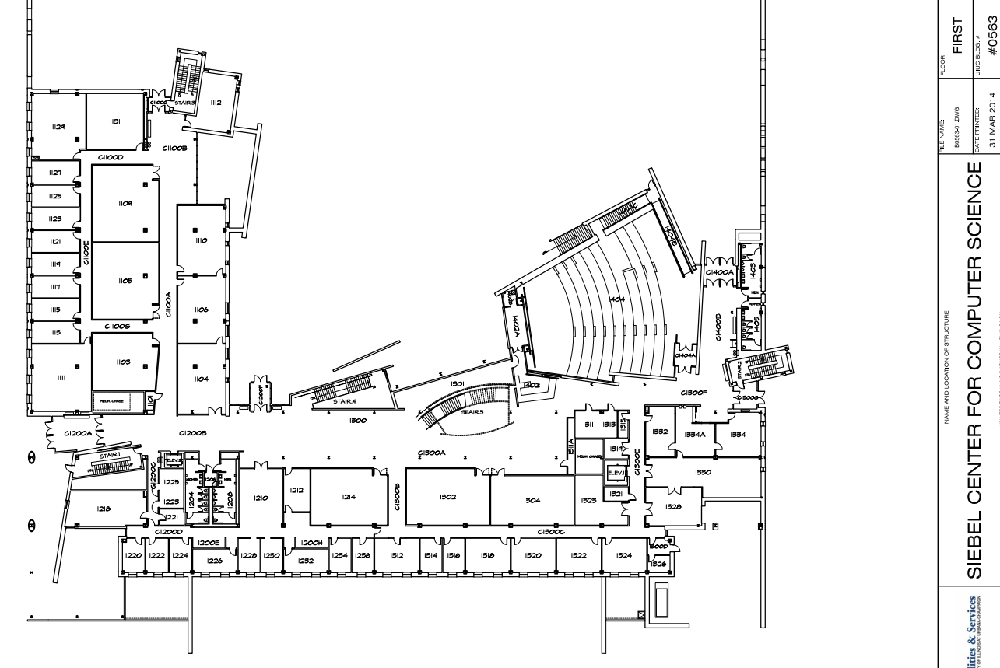
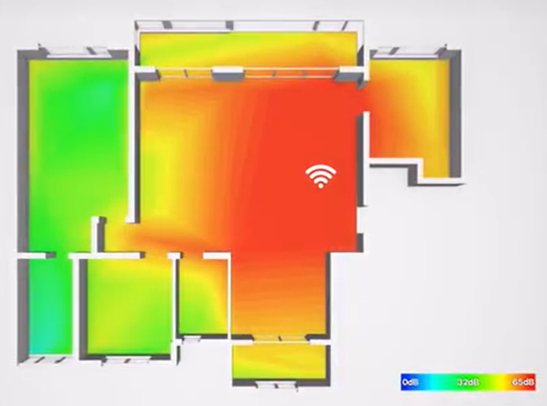
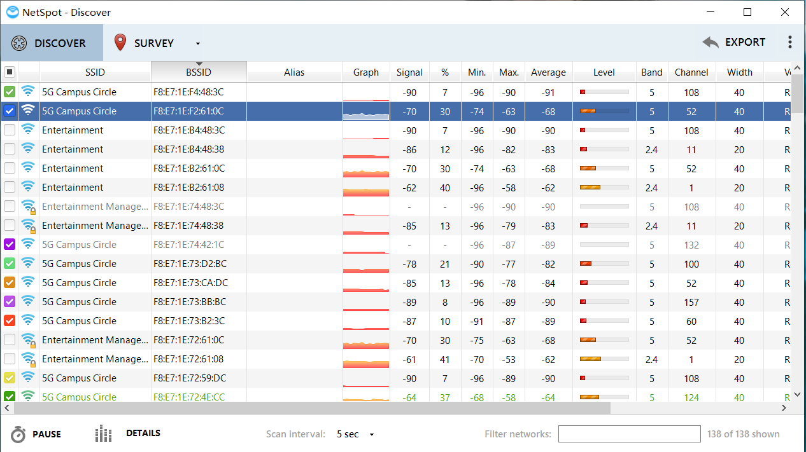
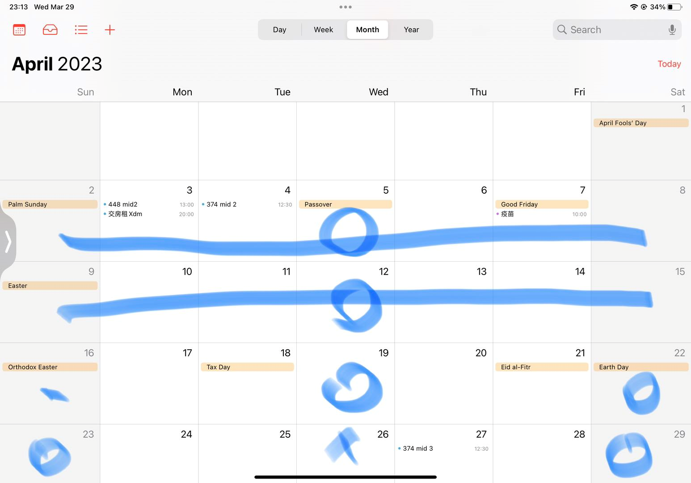

# CS438 Mini-Project Proposal

**Wireless Network Optimization through Signal Strength Measurement and Analysis at Thomas M.siebel Center**

Group StarlinkToSibelCenter

04/05/2023

***Name and Netid***

Wang, Jie  jiew5

Jiaxin, Wu jiaxin19

Luting, Lei lutingl2

[toc] 

### Objective

The primary objective of this project is to analyze the signal strength of WiFi and LTE networks within the Thomas M. Siebel Center, create coverage maps, and identify areas with poor network performance. 

### Background
Currently, there are two main WiFi across the campus, illinois Net and Eduroam. Each is associated with hundreds of connected-routers, which constructed as a wide Campus Area Network(CAN). The Our intuitive interest focus on the mechanism of it. Based on the knowledge we learned in CS438, we plan to investigate how different Access Point(AP) work. By localizing these hidden routers in the Sibel Center, we can optimize existing wireless network infrastructure, which can lead to improved connectivity and user experience for students, faculty, and staff. 

### Methodology

1. **Data Collection:** Utilize WiFi and LTE Analyzer Apps to measure signal strength, network performance, the AP or cell tower connected and other relevant parameters at various locations within the Thomas M. Siebel Center. 

             
First Floor Plan
 

2. **Network Heat Map Creation:** Create a heat map of the Thomas M. Siebel Center using NetSpot and other open-source software, highlighting areas with strong, moderate, and weak signal strength. Identify any dead zones or areas with high network interference. 

          
Heat map Example 
 

3. **Time Variability Analysis:**  Analyze the variability of signal strength and network performance over different times of the day and different days of the week to understand the impact of network usage patterns on signal strength and performance. 

             
Analysis on Campus Circle Network
 

4. **Correlation Analysis:**  Investigate the correlation between signal strength and network performance parameters like throughput and latency. Construct a Python-based model to  determine the effect of factors like distance from the AP or cell tower, physical obstructions, the number of concurrent users, and interference on network performance.  

5. **User Localization:** Explore user location based on detected APs and their signal strengths. Write a python program to monitor the flow density of network usage in the whole building. This can help in understanding user density in different areas of the campus and further optimize network performance.  

6. **AP Switching Analysis:** Monitor and record  which AP the device is connecting to and analyze relevant factors of an AP switch, such as signal strength,  network load, and interference from other devices and distance from the two APs.
   
7. **Improvement Recommendations:** Propose improvements to the existing wireless network infrastructure based on the analysis, such as adding or relocating APs.

### Potential Challenges

1. Limited access to certain areas within the building due to restricted access or ongoing classes.
2. Ensuring accurate and consistent data collection across different devices and platforms.
3. Analyzing the impact of various factors such as interference, building materials, and device density on network performance.

### Plan and Schedule

Week 1:

- Define the data collection methodology and select suitable WiFi and LTE Analyzer Apps.
- Assign data collection responsibilities to each group member and create a data collection schedule.

Week 2:

- Collect data from various locations within the Thomas M. Siebel Center.
- Begin processing and analyzing the collected data to create coverage maps and study network performance.

Week 3:

- Complete data analysis, including time variability and correlation analysis.
- Work on user localization and investigate possible improvements to the wireless network infrastructure.

Week 4:

- Finalize improvement recommendations and write a comprehensive report.

### Expected Outcome
The project aims to provide valuable insights into the current state of the Siebel Center's wireless network and identify areas for improvement. Based on our analysis, student can select the optimized area to study. The proposed enhancements to the network infrastructure should result in better network performance, improved user experience, and more efficient use of network resources.

By the end of the project, our group will deliver a comprehensive report detailing the methodology, findings, and recommendations, along with visual aids such as newtwork heat maps and performance graphs. This report can serve as a foundation for future campus network planning and optimization efforts.

