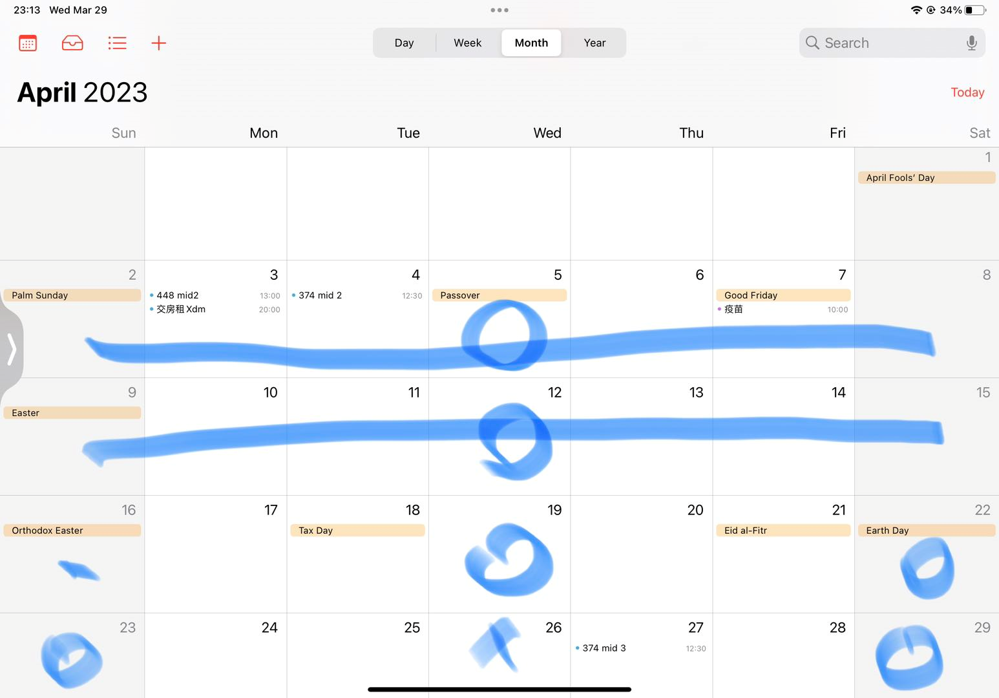
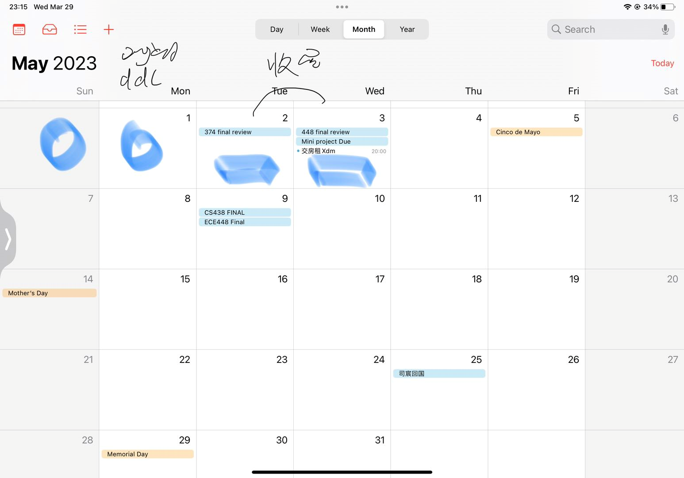

# Miniproject Proposal 0.5
Siebel Center Wireless Network Optimization through Signal Strength Measurement and Analysis

Group 

03/29/2023

*Name and Netid*

Wang, Jie  jiew5

Jiaxin, Wu jiaxin19

Luting, Lei lutingl2

[toc] 

<!-- Typora code-->

---

## Base idea
1. Do survey, read papers and summarize idea, finding the right way of on-hand project

2. choose topic that is concrete, but also abstract enough. 

> For your topic selection, it's important to choose a topic that is specific enough to be manageable but also broad enough to allow for interesting and meaningful research. You might consider doing some preliminary research to identify specific subtopics within each of your potential areas of study.

3. Interest-driven, but avoid collision with others

4. Some techique in China, to distinguish our knowledge and help our understanding 

## Objective
The primary objective of this project is to analyze the signal strength of WiFi and LTE networks across the campus, create coverage maps, and identify areas with poor network performance. Based on this analysis, we aim to propose improvements to the existing wireless network infrastructure to enhance connectivity and user experience.

## Project Description:
The campus wireless network is crucial for students, faculty, and staff to access information and resources. However, there may be areas where the network performance is suboptimal due to weak signal strength or interference. This project aims to address these issues by conducting a comprehensive analysis of the wireless network coverage and performance across the campus.

## Methodology:

Data Collection: Use WiFi and LTE Analyzer Apps to measure signal strength, network performance, and other relevant parameters at various locations across the Thomas M. Siebel Center. Record data such as signal strength, throughput, latency, and the access point (AP) or cell tower to which the device is connected.

Coverage Map Creation: Use the collected data to create a coverage map of Thomas M. Siebel Center, highlighting areas with strong, moderate, and weak signal strength. Identify any dead zones or areas with high network interference.

Time Variability Analysis: Analyze the variability of signal strength and network performance over different times of the day and different days of the week to understand the impact of network usage patterns on signal strength and performance. 

Correlation Analysis: Investigate the correlation between signal strength and network performance parameters like throughput and latency. Determine the effect of factors like distance from the AP or cell tower, physical obstructions, and interference on network performance.

User Localization: Explore the possibility of localizing users based on the detected APs and their signal strengths. This can help in understanding user density in different areas of the campus and further optimize network performance.

Improvement Recommendations: Based on the analysis, propose improvements to the existing wireless network infrastructure. Suggestions may include adding or relocating APs, adjusting transmit power, implementing better network management techniques, or deploying additional LTE cell towers.

Expected Outcomes:
The project aims to provide valuable insights into the current state of the campus wireless network and identify areas for improvement. The proposed enhancements to the network infrastructure should result in better network performance, improved user experience, and more efficient use of network resources.

By the end of the project, the team will deliver a comprehensive report detailing the methodology, findings, and recommendations, along with visual aids such as coverage maps and performance graphs. This report can serve as a foundation for future campus network planning and optimization efforts.

## Potential Challenge

> 1. Consider adding more detail to your plan and schedule. For example, what specific tasks will each group member be responsible for, and what are the deadlines for completing each task? How will you divide your time and resources to ensure that the project is completed on time and to a high standard?

1. time conflict
2. energy consumption 
3. 

##  Plan and Schedule: 

> This should convince you and use that you can complete the project in the given time.
>
> Consider adding more detail to your plan and schedule. For example, what specific tasks will each group member be responsible for, and what are the deadlines for completing each task? How will you divide your time and resources to ensure that the project is completed on time and to a high standard?

- Sunday 4.2 10 am Homework 

- Tuesday 4.4 8 pm Final document
  4号写完proposal，决定handon project 
  - 分工： 论文手，代码手，建模手？

- 每周周会
    - 周会的话就晚上7，8，9点开始

- 4.2-4.16 mp3 讨论一次

5.3 DDL 

