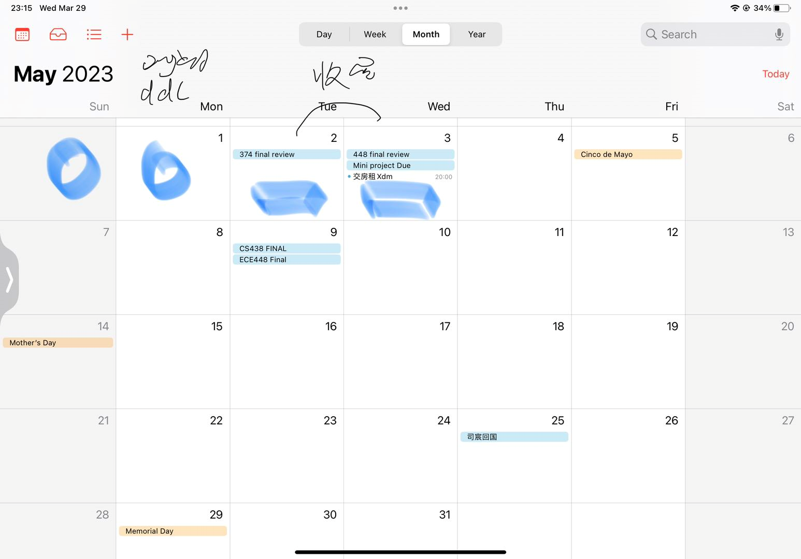

# Miniproject Proposal 0.1
Group 

03/29/2023

*Name and Netid*

Wang, Jie  jiew5

Jiaxin, Wu jiaxin19

Luting, Lei lutingl2

[toc] 

<!-- Typora code-->

---

## Base idea
1. Do survey, read papers and summarize idea, finding the right way of on-hand project

2. choose topic that is concrete, but also abstract enough. 

   > For your topic selection, it's important to choose a topic that is specific enough to be manageable but also broad enough to allow for interesting and meaningful research. You might consider doing some preliminary research to identify specific subtopics within each of your potential areas of study.

3. Interest-driven, but avoid collision with others

4. Some techique in China, to distinguish our knowledge and help our understanding 

## Topic Selction
1. Satellite Networks
- Borrow device! Fast
- 5G, future integration, subtopic 
- 

2. Network Security
- Social Engineering 
    - sounds fishy
- 
3. Fundamentals of blockchains and their applications
- Bitcoin
- 

4. 

## Potential Challenge

> 1. Consider adding more detail to your plan and schedule. For example, what specific tasks will each group member be responsible for, and what are the deadlines for completing each task? How will you divide your time and resources to ensure that the project is completed on time and to a high standard?

1. time conflict
2. energy consumption 
3. 

##  Plan and Schedule: 

> This should convince you and use that you can complete the project in the given time.
>
> Consider adding more detail to your plan and schedule. For example, what specific tasks will each group member be responsible for, and what are the deadlines for completing each task? How will you divide your time and resources to ensure that the project is completed on time and to a high standard?

- Sunday 4.2 10 am Homework 

- Tuesday 4.4 8 pm Final document
  4号写完proposal，决定handon project 
  - 分工： 论文手，代码手，建模手？

- 每周周会
    - 周会的话就晚上7，8，9点开始

- 4.2-4.16 mp3 讨论一次

5.3 DDL 

